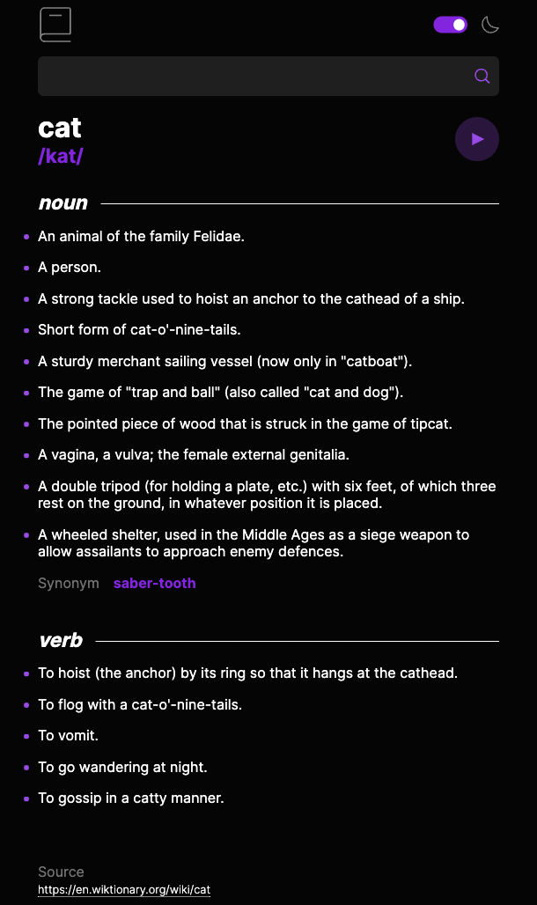

# Dictionary Web App

Dictionary App that uses the Free Dictionary Api : https://dictionaryapi.dev/

## Features

- Can search for any dictionary word
- Offers standard dictionary type with multiple definitions, parts-of-speech, phonetics and examples
- Has audio pronunciation of word
- Handles words that do not exist in dictionary
- SSR app that maintains dark mode and does not "flash" based on user's stored preference

## Built With

- NextJs
- Styled Components
- Typescript
- Axios
- React Testing Library / MSW

## Tests

There are integration tests for all scenarios of successful / unsucsessful searching of a word using React Testing Library and Mock Service Worker. There are a handful of unit tests to document the handling of component state.

## Future Improvements

- Ability to change font
- Additional tests

## Credited Work

- Code for users prefers-color-scheme media query to inline CSS variables for Light / Dark mode comes from: https://joshwcomeau.com/gatsby/dark-mode/
- Design and assets for app comes from FrontEnd Mentor: https://www.frontendmentor.io/challenges/dictionary-web-app-h5wwnyuKFL
